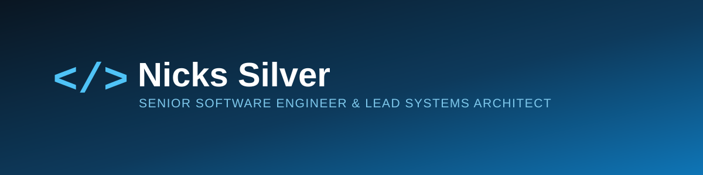

  

### About me

**Senior Software Engineer & Lead Systems Architect** based in Nairobi, Kenya — 5+ years designing, building, and scaling enterprise-grade financial systems, ERPs, and distributed microservices.

- 🏦 Currently architecting core-banking synchronization middleware, KRA eTIMS tax-compliance integrations, and high-throughput background processing (Hangfire/RabbitMQ)
- 🚀 Founder @ **Pronic Labs** — an independent software studio ("Engineered, Not Bought") building purpose-built systems across FinTech & Cooperatives (payment gateway integrations), Institutional EdTech (Acadexa), Construction & Engineering (UltraPMS), Real Estate Tech, Logistics & Supply-Chain, and Enterprise Operations
- 📈 Recent impact: 45x API throughput gains, zero-downtime compliance migrations for national retail chains, and systems serving 130+ universities & 350+ institutions across Kenya
- 🧠 R&D on the side: RAG hallucination reduction and algorithmic trading systems (see below)
- 🤖 All-in on AI-assisted engineering — LLM agents for architecture drafting, automated test generation, and legacy-to-modern refactors
- 🎨 Started out as a graphic designer/brand identity — still shapes how I approach UI/UX and prototyping today
- 📫 Reach me at **[nicks@pronic.co.ke](mailto:nicks@pronic.co.ke)**

### Tech stack

  
  
  
  
  
  
  
  
  
  
  
  
  
  
  
  
  

**Design & prototyping** — before engineering, it was graphic design and brand identity:

  
  
  

### Featured R&D

- **Neural Knowledge Retention (NKR) Framework** — open-source deep learning framework reducing faithfulness hallucinations in RAG pipelines via a custom Contrastive Grounding Loss (PyTorch), fine-tuned on Llama-3 & Mistral-v0.3; >20% hallucination reduction vs. Self-RAG/DoLa baselines on legal & biomedical Q&A.
- **Algorithmic High-Frequency Ingestion Engine** — real-time trading bot over high-throughput WebSockets (Deriv API), with async state management built for low-latency, data-driven execution.

### GitHub stats

  
  

  

### Support

  

⭐ If you find my projects useful, a star goes a long way.

